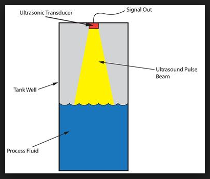
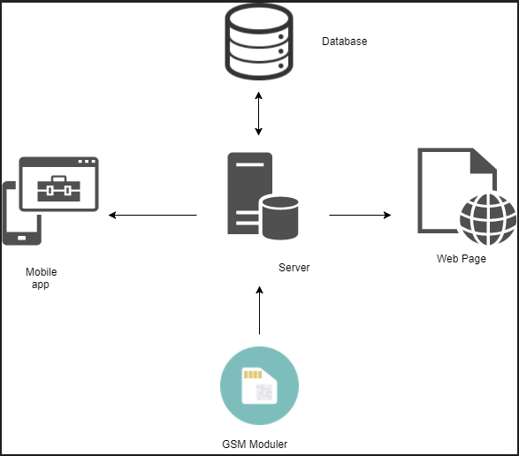
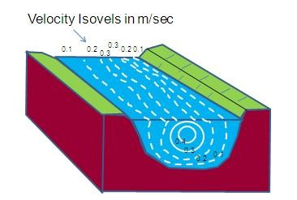
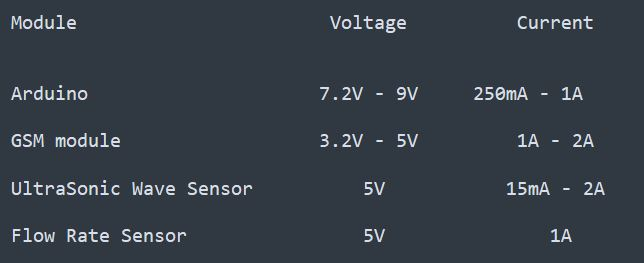
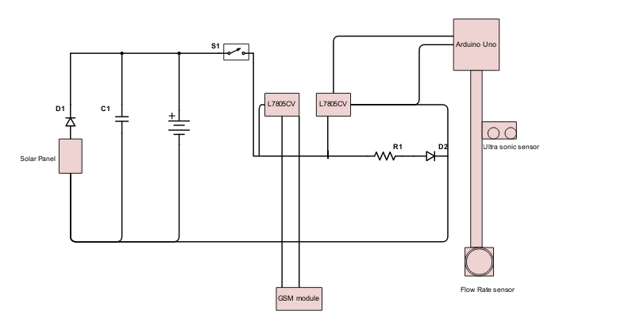
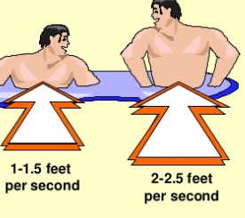
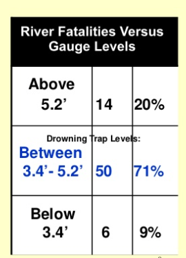

[comment]: # "This is the standard layout for the project, but you can clean this and use your own template"

# River water level and speed monitoring and alert system

---

## Team
-  E/14/080, DILSHANI T.H.K., [e14080@ce.pdn.ac.lk](mailto:e14080@ce.pdn.ac.lk)
-  E/14/228, MUNASINGHE S.L., [e14228@ce.pdn.ac.lk](mailto:e14228@ce.pdn.ac.lk)
-  E/14/240, PAVITHYA M.B.D., [e14240@ce.pdn.ac.lk](mailto:e14240@ce.pdn.ac.lk)

## Table of Contents
1. [Introduction](#introduction)
2. [Solution Architecture](#solution-architecture )
3. [Hardware & Software Designs](#hardware-and-software-designs)
4. [Links](#links)

---

## Introduction

This is a system that will monitor the water levels of a river/lake/stream and predicts the occurrence of a flood and generate an alert accordingly. This system would not only measure the water level but also the water velocity in order to give a better prediction of the risky situations.

 

[Background work](http://www.irrigation.gov.lk/index.php?option=com_riverdata&Itemid=266&lang=en)

Currently, this site gives an update of the river status of Sri Lanka. However this system is based on manually collected data and is updated only once per day. By constantly keeping track of this site we found that there are certain times that the system doesn’t output any data at all. Due to these reasons we proposed a sensor based flood alert system through water level and velocity monitoring.

This project will be covering aspects from embedded systems (CO321), Network and web application design (CO324), Computer and network security (CO325)  

- [Intro Video](https://youtu.be/rjGkhPKiJhA)

## Solution Architecture

As this is a unified project, this project is consisted of aspects of embedded systems, networking and security.

CO 321 - Sensors are used to measure the water level and to detect the speed of water flow. An equipment with the above mentioned capabilities would be built to analyse those parameters real time and to capture the data.

CO 324 - The captured data would be sent to a centralized server in which a warning would be generated if a risk of a flood situation is seen.

CO 325 - The network system should be encrypted and the alert system should be accessed only by the authorized personnel.  

## Hardware and Software Designs

### Embedded Systems Design  
We would be measuring the water level of streams/rivers/lakes and the velocity of the water flow of such bodies. To measure the water level we are using ultra sonic sensors which should be implemented above the water body and the sensor would output the distance from that given body to the surface of the water. Through this we could check whether there’s a significant change in the water level by comparing this data with the pre-collected data. There were other sensing methods to get the water level but we chose ultra-sonic sensors as the best due to its accuracy when compared with other methods and its easy-maintainability since the components do not get in touch with the water (no rusting, less depreciation)  

  

The flow rate sensor has to be emerged somewhere below the surface (according to the principles of hydro physics as at this point a more accurate measurement regarding flow rate of a river could be obtained) The flow meter works on the principle of the Hall effect. According to the Hall effect, a voltage difference is induced in a conductor transverse to the electric current and the magnetic field perpendicular to it. Here, the Hall effect is utilized in the flow meter using a small fan/propeller-shaped rotor, which is placed in the path of the liquid flowing. The liquid pushes against the fins of the rotor, causing it to rotate. The shaft of the rotor is connected to a Hall effect sensor. It is an arrangement of a current flowing coil and a magnet connected to the shaft of the rotor, thus a voltage/pulse is induced as this rotor rotates. In this flow meter, for every liter of liquid passing through it per minute, it outputs about 4.5 pulses. This is due to the changing magnetic field caused by the magnet attached to the rotor shaft as seen in the picture below. We measure the number of pulses using a micro-controller.  
  
We chose Arduino UNO as the micro-controller because of its moderate price over other micro-controllers and because it serves our purpose. We just need to get the output signals of our sensors and some simple computations, so arduino UNO would suffice.  

We’d be also using an A7 GSM module to capture the signals from the micro-controller and to transfer these signals to the centralized server.  

#### Interface of the system  

  

#### Limitations  

  - Ultra-sonic sensor : The height from the surface to the fixed point can be obtained only with an accuracy of +-1cm. But since we do not need the minute changes of the water level and measure only the drastic changes, this error could be tolerated. With time, there might be a possibility to have a moisture layer on the face of the sensors and that’d change the density between the surface and might lead to erroneous results.
 

  - Flow-rate sensor : Since the flow rate is embedded within a tube, the friction and the cohesive forces exerted by the walls of the tube would hinder obtaining the exact flow rate at the point. But since the velocity of a flowing water body is not uniform, there’s no point in trying to get the exact velocity. We can position the flow rate sensor in a place the maximum velocity could be measured (somewhere just beneath the surface) and that would be effective than getting the exact value since this measurement is going to be an average estimation of the velocity.  

### Web and Network Application Design  

#### Protocols and middle ware  

  - Http/Https : To access the web application
  - TCP/IP
  - UDP : for DNS
  - GPRS protocol
  - Centralized web server: This centralized web server will maintain the main database and will be connecting to the web interface and the mobile application. The server should also manage the accounts of the administration.  

#### Back end technologies  

  - 000Webhost(might switch to a cloud platform like heroku)
  - Laravel  

#### Front end technologies  
Web Interface:  
  - HTML  
  - CSS  
  - Bootstrap  
  - JavaScript  

Mobile Application:  

  - Android Studio  

We’d be using Google maps API in the web interface in order to show the location based river status of the country.  

### Computer and Network Security  

There are no sensitive data on our system,as anyone outside viewing the data won’t do any harm (since it is anyway accessible by the public through the web interface and the data contains only the measurement of water level and velocity) . But there should not be a  possibility that any unauthorized 3rd party manipulating the data. The server protection should be taken into serious consideration and  therefore authentication of the server could be done.  

### Power Supply  

  

  

  

### Threshold values  

The finalized threshold values used in the safety prediction application :

In order to generate the danger alerts with respect to a river body, knowing the velocity alone won't be sufficient. In order to give the maximum accuracy we are improving the system by taking many other factors into consideration. The safety of a river body would vary with aspects like depth and the level of height that is submerged by a man.

In waist deep water it takes roughly 2-2.5 feet per second to push a man over a water body and in chest deep water it's roughly about 1-1.5 feet per second.  

  

The threshold values may vary due to the depth of the water body also.  

### Documents  
See for the attached pdf for the final Plan and design blue prints. This includes all the fine details regarding hardware design,network design,database design,the technologies used and the security aspects. This also covers the budget and the timeline plan.  

  - [Project Plan](data/documents/2.pdf)  

## Links

- <a href = "https://github.com/cepdnaclk/e14-3yp-River-water-level-and-speed-monitoring-and-alert-system" target = "_blank">Project Repository</a>
- <a href = "https://cepdnaclk.github.io/e14-3yp-River-water-level-and-speed-monitoring-and-alert-system/" target = "_blank">Project Page</a>
- <a href = "http://www.ce.pdn.ac.lk/" target = "_blank">Department of Computer Engineering</a>
- <a href = "https://eng.pdn.ac.lk/" target = "_blank">University of Peradeniya</a>

[//]: # (Please refer this to learn more about Markdown syntax)
[//]: # (https://github.com/adam-p/markdown-here/wiki/Markdown-Cheatsheet)
